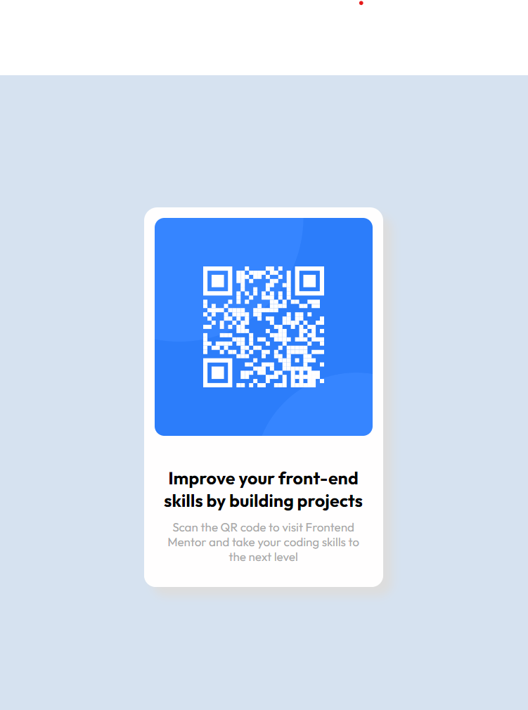

# Frontend Mentor - QR code component solution

This is a solution to the [QR code component challenge on Frontend Mentor](https://www.frontendmentor.io/challenges/qr-code-component-iux_sIO_H).

## Table of contents

- [Frontend Mentor - QR code component solution](#frontend-mentor---qr-code-component-solution)
  - [Table of contents](#table-of-contents)
  - [Overview](#overview)
    - [Screenshot](#screenshot)
    - [Links](#links)
  - [My process](#my-process)
    - [Built with](#built-with)
    - [What I learned](#what-i-learned)
    - [Continued development](#continued-development)
    - [Useful resources](#useful-resources)
  - [Author](#author)
  - [Acknowledgments](#acknowledgments)

## Overview

### Screenshot

### Links

- Solution URL: [GitHub repository](https://github.com/sarcarsarbo/CSS-Flexbox)
- Live Site URL: [Add live site URL here](https://your-live-site-url.com)

## My process

### Built with

- Semantic HTML5 markup
- CSS custom properties
- Flexbox
- Mobile-first workflow

### What I learned

This project allowed me to understand and implement CSS flexboxes to replicate a clean and minimalist design for a static page.

### Continued development

Further features can be added to the static site.

### Useful resources

- [Aligning items in a flex container](https://developer.mozilla.org/en-US/docs/Web/CSS/CSS_flexible_box_layout/Aligning_items_in_a_flex_container) - This helped me to understand the layout better and align the items properly.
- [CSS Box Shadow](https://developer.mozilla.org/en-US/docs/Web/CSS/box-shadow) - This helped me to implement box shadows in CSS, a feature that subtly leveraged the design.

## Author

- Frontend Mentor - [@sarbosarcar](https://www.frontendmentor.io/profile/sarbosarcar)

## Acknowledgments

I extend my gratitude to the above cited websites and articles contained therein that have helped me build the webpage successfully.
